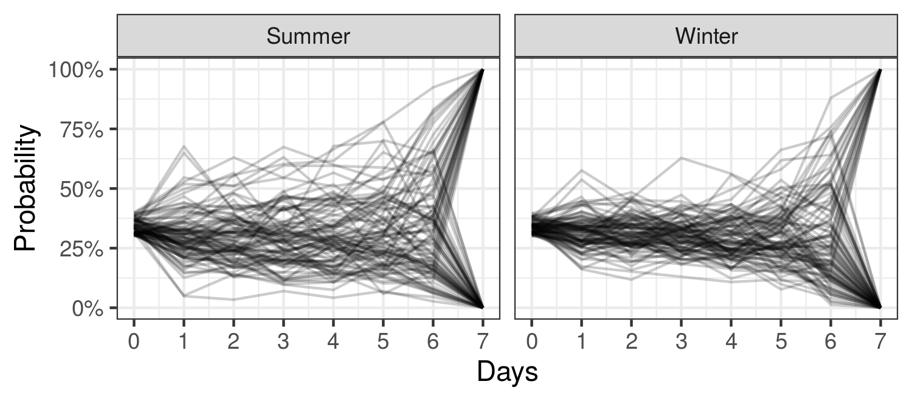
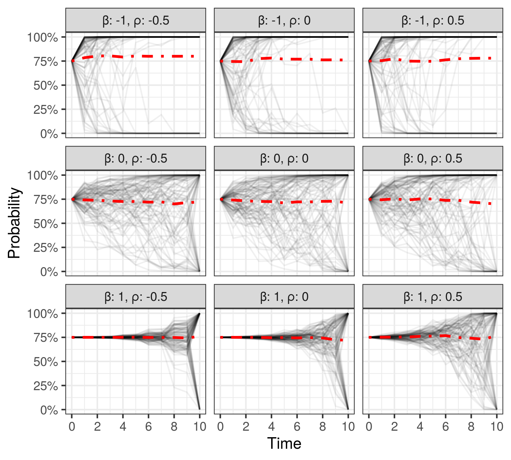

# Probability Paths and the Structure of Predictions over Time
This is the code repository for reproducing results in paper *Probability Paths and the Structure of Predictions over Time* by Zhiyuan Jerry Lin, Hao Sheng, and Sharad Goel.



The plot above shows a collection of dynamic forecasts of rainfall across several Australian cities during the summer and winter, starting one week before the target date. All forecasts initially indicate an approximately 35% chance of rain. But the forecast trajectories -- which we call probability paths -- have higher volatility in the summer than in the winter.

The Gaussian latent information martingale, or GLIM, is developed to model such probability paths coherently. The plot below shows that even with only two parameters, GLIM is able to model a wide variety of probability path shapes.




## Reference

Lin, Zhiyuan Jerry, Hao Sheng, and Sharad Goel. "Probability Paths and the Structure of Predictions over Time." Advances in Neural Information Processing Systems (NeurIPS), 2021.

### Bibtex
```
@inproceedings{lin2021probability,
 author = {Lin, Zhiyuan Jerry and Sheng, Hao and Goel, Sharad},
 booktitle = {Advances in Neural Information Processing Systems},
 title = {Probability Paths and the Structure of Predictions over Time},
 year = {2021}
}

```

## Getting Started
- Clone this repo which contains data as well: 
```
git clone https://github.com/stanford-policylab/glim.git
```

## Run baseline model
Sampled paths from each model are included in the `data/output` folder. However, if you wish to re-run one or more models, please follow commands below:

### Linear regression 
```
cd src/baseline
python main.py lr --env [weather, nba]
```

### Bayesian LSTM
```
cd src/baseline
python main.py mqlstm --env [weather, nba]
```


### MMFE
```
# In root directory
Rscript src/baseline/mmfe.R
```

### Run GLIM
```
# Preprocess input data
# For example, Rscript make_and_save_data_clean.R nba
Rscript make_and_save_data_clean.R [weather, nba]

# Fit GILM model using either MAP estimate or MCMC with Stan
# For example, Rscript run_glim_model.R nba map
Rscript run_glim_model.R [weather, nba] [map, mcmc]

# Generating sample paths with GLIM
# For example, Rscript gen_paths.R nba map 100
Rscript gen_paths.R [weather, nba] [map, mcmc]

# Run simulation study
Rscript sim_param_recover.R
```

## Plot
After generating sample paths for nba, weather, and the simulated datasets,

we can run the evaluation script:
```
# In root directory
Rscript evaluation.R [weather, nba]
```

And then plot the result:
```
# In root directory
Rscript plot.R
```
